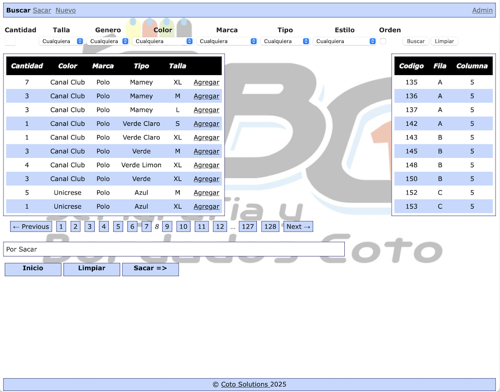
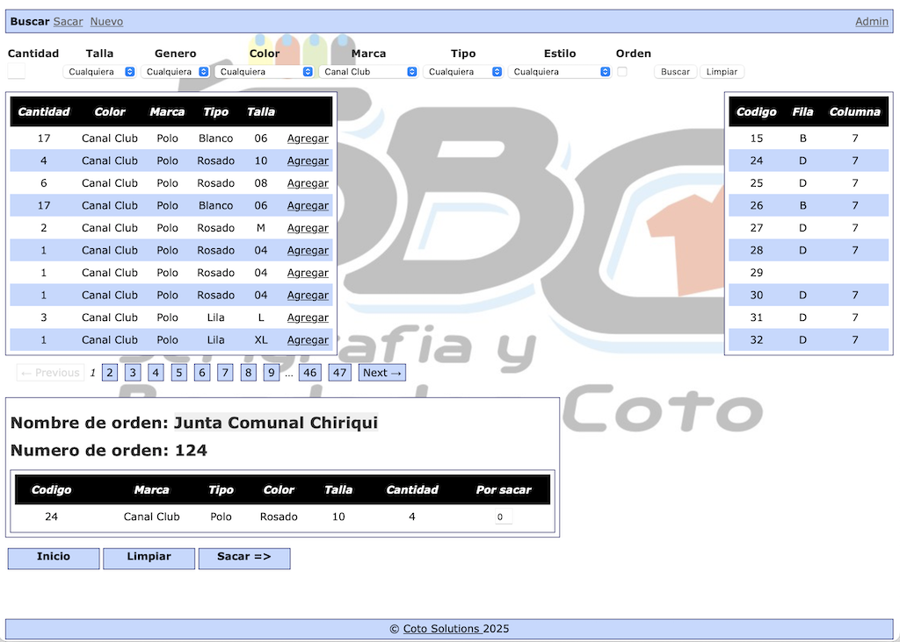

# Inventario - An Embroidery Inventory Management System

This was a Rails 2.x application that I development while working with [SBC Panamá](https://nelsonroberto.com/portfolio/sbc-panama/), from 2007 to 2012, that tracked the company's inventory and helped workers pull shirts to be used in production. During it's use this application helped track and manage inventory items, mostly T-Shirts and Polo shirts, that were being used to fulfill orders. It allowed workers to quickly locate products in a room storing thousands of items, and helped with the restocking process.

I've used Claude Code to resurrect this project from the dead, migrating it to Rails 4.2, but the original application was designed, development and maintained by me.

## Screenshots

### Search & Browse Inventory

*Main search interface with filters for brand, color, size, type, and style. Results show quantity and bin location (row/column).*

### Select Items for Orders

*Adding items to an order. The "Por Sacar" panel shows items queued for pulling.*

### Fulfillment Queue

*The "Para Sacar" view lists all items to be pulled, organized by bin location for efficient warehouse picking.*

## Overview

This application helps manage inventory by:

- Tracking groups of shirts stored in bins
- Locating shirts to use for an order
- Restocking shirts after they have been pulled

**Tech Stack:**

- **Ruby version:** 2.7.8
- **Rails version:** 4.2.11.3
- **Database:** MySQL 8.0 (production/development), SQLite3 (test)

## Prerequisites

- [Docker](https://www.docker.com/get-started) (20.10 or higher)
- [Docker Compose](https://docs.docker.com/compose/install/) (1.29 or higher)
- Git

## Quick Start

1. Clone the repository:

   ```bash
   git clone https://github.com/dewittn/rails-sbc-inventario
   cd rails-sbc-inventario
   ```

2. Set up environment variables:

   ```bash
   cp .env.example .env
   ```

   Edit `.env` if you need to customize any settings (optional). The default values work out of the box.

3. Build and start the containers:

   ```bash
   docker compose build
   docker compose up -d
   ```

4. Set up the database:

   ```bash
   docker compose exec web rake db:schema:load
   docker compose exec web rake db:seed
   ```

5. Access the application:
   - Open your browser to <http://localhost:3000>
   - Login at <http://localhost:3000/login> with:
     - Username: `admin`
     - Password: `password123`

### Common Docker Commands

**View running containers:**

```bash
docker compose ps
```

**View logs:**

```bash
docker compose logs web      # Rails application logs
docker compose logs db       # MySQL database logs
docker compose logs -f       # Follow all logs in real-time
```

**Stop the containers:**

```bash
docker compose stop
```

**Stop and remove containers:**

```bash
docker compose down
```

**Access Rails console:**

```bash
docker compose exec web rails console
```

**Run migrations:**

```bash
docker compose exec web rake db:migrate
```

**Seed the database (creates admin user):**

```bash
docker compose exec web rake db:seed
```

**Run tests:**

```bash
docker compose exec web rake test
```

**Restart containers:**

```bash
docker compose restart
```

### Environment Variables

The application uses a `.env` file for configuration. Copy `.env.example` to `.env` to get started:

```bash
cp .env.example .env
```

Available environment variables:

- `MYSQL_ROOT_PASSWORD` - MySQL root password (default: makaveli)
- `MYSQL_DATABASE` - Database name (default: inventario_dev)
- `MYSQL_USER` - Database user (default: postgres)
- `MYSQL_PASSWORD` - Database password (default: makaveli)
- `DATABASE_HOST` - Database host (default: db)
- `MYSQL_PORT` - MySQL port mapping (default: 3306)
- `RAILS_PORT` - Rails application port (default: 3000)
- `RAILS_ENV` - Rails environment (default: development)
- `BUNDLER_VERSION` - Bundler version (default: 1.17.3)

### Database Information

- **Database:** MySQL 8.0
- **Database name:** Configured via `MYSQL_DATABASE` (default: inventario_dev)
- **Username:** Configured via `MYSQL_USER` (default: postgres)
- **Password:** Configured via `MYSQL_PASSWORD` (default: makaveli)
- **Host:** Configured via `DATABASE_HOST` (default: db within Docker network)
- **Port:** Configured via `MYSQL_PORT` (default: 3306, accessible from host at localhost:3306)

### Troubleshooting

**If the database connection fails:**

The database might still be initializing. Wait a few seconds and try again:

```bash
docker compose logs db    # Check if MySQL is ready
docker compose restart web
```

**If you need to reset the database:**

```bash
docker compose exec web rake db:drop db:schema:load db:seed
```

**If you need to rebuild from scratch:**

```bash
docker compose down -v           # Remove containers and volumes
docker compose build --no-cache  # Rebuild without cache
docker compose up -d
docker compose exec web rake db:schema:load db:seed
```

## Authentication

The application uses a username/password authentication system.

### Default Admin User

When you run `rake db:seed`, a default admin user is created:

- **Username:** `admin`
- **Password:** `password123`
- **Login URL:** <http://localhost:3000/login>

**Important:** Change the admin password after first login in a production environment.

### Creating Additional Users

Users can be created in two ways:

1. **Via signup form:** Visit <http://localhost:3000/signup>
2. **Via Rails console:**

   ```bash
   docker compose exec web rails console
   # Then:
   User.create(
     login: 'username',
     email: 'user@example.com',
     password: 'password',
     password_confirmation: 'password',
     name: 'Full Name'
   )
   ```
